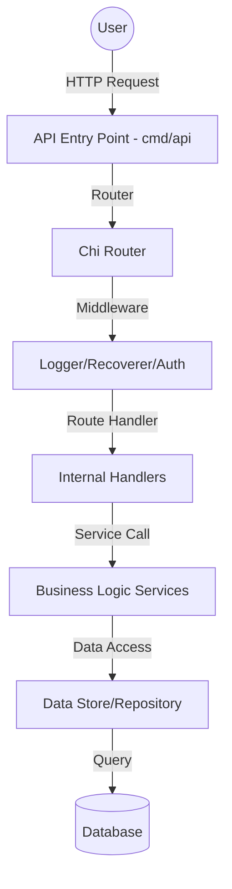

# Ecommerce API Project

## Project Rules
1. **Clean Architecture**: Separate concerns between handlers, services, and repositories.
2. **Dependency Injection**: Pass dependencies (database, config) explicitly to structs.
3. **Error Handling**: Wrap errors with context (e.g., `fmt.Errorf("service: %w", err)`).
4. **Validation**: Validate all incoming requests before processing.
5. **Consistency**: Use a standard JSON response format for all endpoints.
6. **Logging**: Log important events and errors using a structured logger.

## Architecture Diagram


## Setup Progress
- [x] Define Project Rules
- [x] Create Architecture Diagram
- [x] Project Initialization
- [ ] Core Infrastructure
- [ ] API Foundation
## Best Project Structure 

```   
project
├── cmd                      # Command-related files
│   └── app                  # Application entry point
│       └── main.go          # Main application logic
├── internal                 # Internal codebase
│   ├── handlers             # HTTP request handlers (controllers)
│   │   └── user_handler.go  # User-specific handler
│   ├── services             # Business logic (service layer)
│   │   └── user_service.go  # User-specific service
│   ├── repositories         # Data access (repository layer)
│   │   └── user_repo.go     # User-specific repository
│   └── models               # Data models (entities)
│       └── user.go          # User model
├── pkg                      # Shared utilities or helpers
├── configs                  # Configuration files
├── go.mod                   # Go module definition
└── go.sum   
```

---

## TODO for Tomorrow
- [ ] **Restructure**: Move the boilerplate to the new project layout.
- [ ] **Data Layer**: Set up Database (PostgreSQL) and implement the **Repository** layer.
- [ ] **Logic Layer**: Implement **Services** and **Models** for core features.
- [ ] **API Layer**: Create complex **Handlers** (e.g., Users, Products).
- [ ] **Security**: Implement **JWT Authentication** middleware.
- [ ] **Validation**: Add request validation logic.